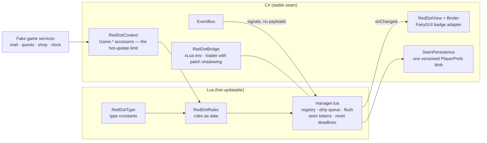

# ui-reddot-system

**A production-shaped "red dot" notification system for live-service mobile UIs — Unity, FairyGUI, and Lua (xLua), with the rules hot-updatable at runtime.**

A clean-room portfolio sample by [Kaan Altay](https://github.com/kaan1altay). I work professionally on the client of a live-service mobile ARPG; this repo is a from-scratch implementation of the badge-notification architecture I'd ship today — written entirely for this repository.

*The core demo: "Start limited offer" does nothing — the rule doesn't exist. Apply a Lua patch (nothing lights: installing a patch is invisible by design), press it again — the Shop badge lights through a rule that shipped one second ago. No C# was rebuilt.*

---

## The problem

Every live-service game has red dots: "unread mail", "claimable quest", "new shop rotation". Done naively, every screen polls every manager every frame and the lobby buttons are wrong until their pages are opened once. Done well, it's a small piece of infrastructure with hard requirements:

- The UI must never compute anything. A badge says *"I am `MailItem|42`"*; **when** it lights is the rule table's decision, **when** it re-evaluates is the event system's.
- LiveOps adds and changes badges weekly. Rules must be **data, shipped in Lua, replaceable at runtime** — not C# waiting for an app-store release.
- A lobby button must be correct **before** its page is ever opened; a list row's badge must exist **only while** its page is open.
- 50 events in one frame must not mean 50 evaluations.

## The model

**A dot is a type plus ordered keys.** `RedDotType.lua` declares the types; a concrete dot's identity is `"Shop"`, `"MailItem|42"`, `"QuestItem|3|17"`. Two lifecycles follow from it:

- **Global (keyless)** dots are created at boot and always live — the lobby buttons are right from the first frame.
- **Keyed** dots are created on first `Subscribe` and destroyed when their last subscriber unbinds — they exist only while their page does. No leaks, verified by live counts in the demo log.

**A rule is a data entry, not code wiring.** Per type: a `condition(keys..., isUnseen?)` predicate over real game state, the `events` that dirty it, optional `tracksSeen` + `token()` for "new content" semantics, optional `resetAt()` for scheduled boundaries (daily shop reset). Shared event-set tables let one added event reach every rule that reads the same data.

**Events queue; flush computes.** An event never evaluates anything — it marks the type's live dots dirty. One flush per frame evaluates each queued dot at most once and notifies only the subscribers whose value actually changed. Binding computes synchronously, so a component bound mid-frame is correct immediately.

**Seen is a token, not a flag.** `MarkSeen` stores the rule's *current content stamp*. New content moves the stamp, the stored mark no longer matches, the dot relights. A `nil` token means "data not loaded — don't judge yet". Persistence is one versioned JSON blob in PlayerPrefs, written at most once per frame; corrupted or older versions degrade to a clean slate.

**Dot values are never saved.** Only seen tokens (and the demo clock) persist. Values are derived — recomputed from live game state at boot. In a real game, persistence lives in the managers the rules read, never in the badge layer.

## Hot updates, honestly

`reloadRules(newRules)` swaps the whole rule table: subscriptions are diffed, everything re-evaluates, bindings survive because they reference identities, not rule objects. The demo patch does the two things that matter in production:

1. **Adds a new type** (`LimitedOffer`) with its rule and events — a badge no C# file mentions.
2. **Rewrites a shipped rule**: the Shop rule gains the offer's event and folds a running offer into its seen-token. Adding a badge is easy in any model; *changing what a shipped badge means* is what hot-updating is for.

And the honest limit is explicit: rules can only read what the C# context exposes (`Game.*` accessors, plus a generic counter as the LiveOps escape hatch). That boundary — only strings, booleans and numbers cross Lua↔C#, no generated glue — is one C# file.

## Safety & tooling

- Every `condition`/`token` call is wrapped in `pcall`: a broken rule logs once and reads `false`. A bad patch can't crash the game.
- **Boot validation** catches rule-table typos as errors at startup (a token without `tracksSeen`, a rule that can never light, a rule nothing ever refreshes, an unknown event name) — instead of as a badge that silently never works.
- A **reconcile checker** (editor-only) recomputes everything once per second and logs any mismatch with the cached values — the proof that the event wiring is complete, and the reason the no-polling claim isn't a leap of faith. The 10k-iteration fuzz test asserts `Reconcile() == 0` after every flush and every rules reload.
- `DumpState()` and live dot counts are wired into the demo's on-screen log.

## Architecture

The engine is ~small, deliberate Lua; C# knows nothing about any specific badge. The FairyGUI package (authored in the FairyGUI Editor; source in `FGUIProject/`) contributes one reusable `RedDotBadge` component with a `state` controller — the view layer only selects controller pages.

## Try it

Unity 6 (6000.0.x). xLua v2.1.16 and FairyGUI 5.2.0 are vendored (runtime only — see the `VENDORED.md` files).

1. Clone, open in Unity.
2. Open `Assets/Scenes/RedDotDemo.unity`, press Play.
3. Drive it: open Mail / Quests / Shop, add mail, complete and claim quests, start a limited offer after applying the Lua patch, advance the demo clock a day, toggle the reconcile checker — the on-screen log narrates every subscribe, flush and seen-mark.

Tests: **95 EditMode + 12 PlayMode**, all driving the real Lua through the real bridge (Test Runner, or headless via `-runTests`; close the Editor first). The fuzz run alone covers thousands of random events, marks, binds, reloads and restarts with full-reconcile and exact-notification invariants.

## Battle-tested by hand

Beyond the suite, the demo was play-tested adversarially, and each finding became a regression test: stale views on screen re-entry (fixed by compute-on-subscribe), a seen-token stuck behind newly arriving content (fixed by marking the open screen on action), two "condition can become true with nothing to make it false" wirings (caught by a written action-pair audit — the class of bug no static check can find), and a patch that lost its link to a shipped badge in a redesign (fixed by letting patches rewrite shipped rules — the better demo, it turned out).

## Scope / non-goals

Boolean dot values by design (the badge's `count` page is a forward-compatible view convention); fake in-memory game services (they stand in for a game rather than being one); single save slot; no server push — see `docs/STATUS.md` for the full decision log.

## License

MIT — see [LICENSE](LICENSE).