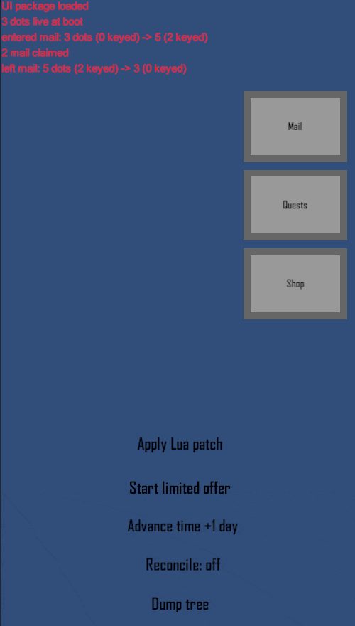
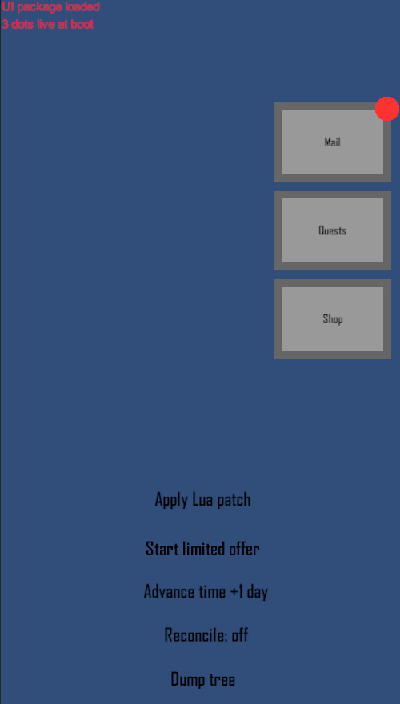

# ui-reddot-system

A data-driven, hot-updatable **red dot (badge) notification system** for live-service
mobile UIs — every badge is a rule in **Lua (xLua)**, the views are **FairyGUI**, and the
C# in between knows nothing about what any badge means.

> **Complete.** The engine, the FairyGUI view layer, the authored UI package and a
> playable demo are in, with 95 EditMode and 12 PlayMode tests green. See
> [docs/STATUS.md](docs/STATUS.md) for the architecture, the design decisions and what
> five rounds of play-testing changed.

## See it working

**A live-ops patch adding a badge the build never shipped.** Apply the patch, start an
offer, and the lobby Shop button lights -- through a rule rewritten at runtime, with no
C# rebuilt and no scene reloaded. Opening the shop counts as seeing it.



**The keyed lifecycle.** One dot per mail row, created when the row binds and destroyed
with the last subscriber. Watch the live dot count in the debug log rise on entering the
mailbox and fall on leaving it.



**Seen state and the scheduled reset.** A badge clears when the player looks, and comes
back by itself when the content behind it changes -- including at a day boundary that no
event announces.


## The idea

Every live-service game grows a red dot system, and it is always the same problems: the
rules change more often than the client ships, badges have to be right the first time a
screen opens, lists create and destroy hundreds of them, and naive implementations
recompute everything every frame.

A badge is a rule, and a rule is data:

```lua
-- Assets/Lua/reddot/RedDotRules.lua -- the only file that knows what a badge means
[RedDotType.Mail] = {
    events     = MAIL_EVENTS,
    tracksSeen = true,
    token      = function() return Game.Mail:InboxToken() end,
    condition  = function(isUnseen) return isUnseen or Game.Mail:ActionableCount() > 0 end,
},

[RedDotType.MailItem] = {
    keys      = { "mailId" },
    events    = MAIL_EVENTS,
    condition = function(mailId) return Game.Mail:IsActionable(mailId) end,
},
```

- **Identity is a type plus keys.** `"Shop"`, `"MailItem|42"`, `"QuestItem|3|17"`. Global
  dots exist from boot, so a lobby button is correct before its screen has ever been
  opened. Keyed dots are created when a row binds and destroyed with the last subscriber,
  so a list of 500 costs 500 dots while it is open and none afterwards.
- **No aggregation.** Every dot answers its own question. Nothing is defined as the sum of
  its children, which is what lets a badge be correct on a tree that does not exist yet.
- **Queue, then flush.** Events mark dots pending and compute nothing; one drain per frame
  evaluates each pending dot at most once and notifies only what changed. Subscribing is
  the deliberate exception — it computes synchronously, so a re-entered screen is right on
  the frame it opens.
- **Seen state is a token, not a flag.** Marking seen stores what the player saw, so new
  content re-arms the badge by itself.
- **Hot-updatable.** `ReloadRules` swaps the table at runtime, diffs the event
  subscriptions and creates dots for any new global type. The demo has a button that adds
  a badge no C# file mentions, live.

## Diagnostics that earn their keep

`DumpState()` prints the registry, the seen set and the counters. And the reconcile
checker recomputes everything once a second and logs `MISMATCH` where the cache and a
fresh evaluation disagree — **fixing nothing on purpose**, because a mismatch means a
rule is missing an event, and the cache was right about what it was told.

## The view layer

A badge is a FairyGUI component named `redDot` carrying a controller named `state` with
the pages `hidden` / `dot` / `count`. The adapter picks the page; the controller's gears
do the rest, and every missing piece degrades rather than throws.
`SetRedDotActive(component, false)` is an external kill switch — visible is the rule value
*and* the screen's say-so — for tutorials and locked tabs, so presentation never leaks
into the rules. The full authoring contract is in
[docs/PACKAGE_SPEC.md](docs/PACKAGE_SPEC.md).

## Running the demo

Open `Assets/Scenes/RedDotDemo.unity` and press Play. Tabs open sections, buttons poke the
fake mail / quest / shop services, and the debug panel applies the example Lua patch,
advances the clock a day to fire a scheduled reset, and toggles the reconcile checker.

If the authored UI package is ever missing, the demo builds the same screens in code and
says so in the console. Everything is playable either way.

## Running the tests

```
"C:\Program Files\Unity\Hub\Editor\6000.0.59f2\Editor\Unity.exe" ^
  -batchmode -nographics -projectPath . ^
  -runTests -testPlatform EditMode -testResults TestResults\results.xml -logFile -
```

Swap `EditMode` for `PlayMode` for the scene smoke tests, or use
**Window → General → Test Runner** in the Editor. Batchmode needs the Editor closed.

## Layout

| Path | What lives there |
| --- | --- |
| `Assets/Lua/reddot/` | the engine: types, events, rules, manager, seen store, json |
| `Assets/Lua/patches/` | the example live-ops patch |
| `Assets/Scripts/RedDot/` | the bridge, the FairyGUI view and the binding lifetime |
| `Assets/Scripts/Demo/` | the demo bootstrap, the code-built UI, fake game managers |
| `Assets/Tests/` | 95 EditMode cases and 12 PlayMode smoke tests |
| `FGUIProject/` | the FairyGUI Editor source of the UI package |
| `docs/STATUS.md` | architecture, design decisions, test results, what comes next |
| `docs/PACKAGE_SPEC.md` | how to author the FairyGUI package the demo binds to |

## Dependencies

Vendored, runtime only, with the parts that were left out recorded next to them:

- [xLua](https://github.com/Tencent/xLua) v2.1.16 — MIT — `Assets/XLua/VENDORED.md`
- [FairyGUI](https://github.com/fairygui/FairyGUI-unity) 5.2.0 — MIT — `Assets/FairyGUI/VENDORED.md`

Built with Unity 6000.0.59f2.

## License

MIT — see [LICENSE](LICENSE).
